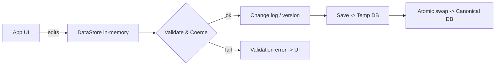
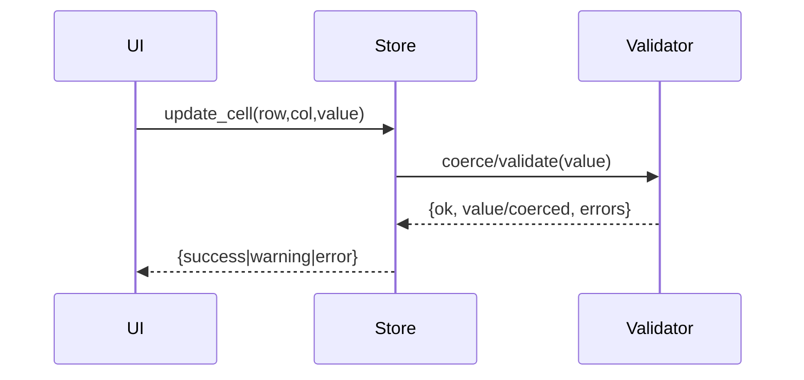
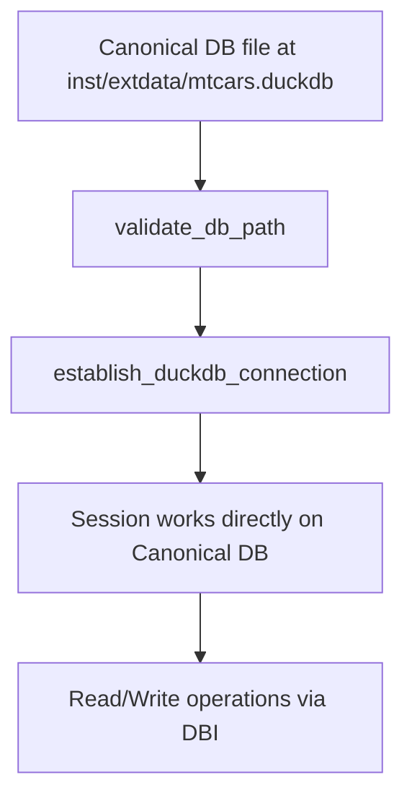
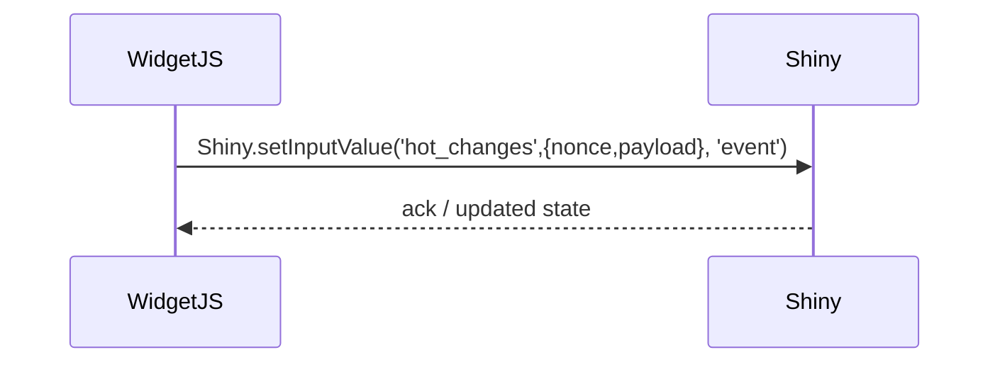
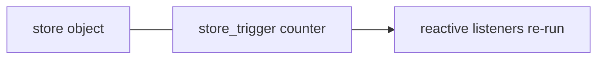
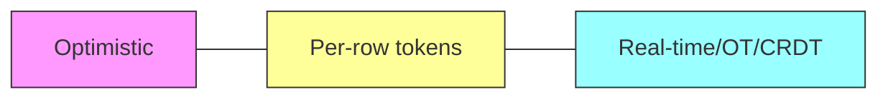
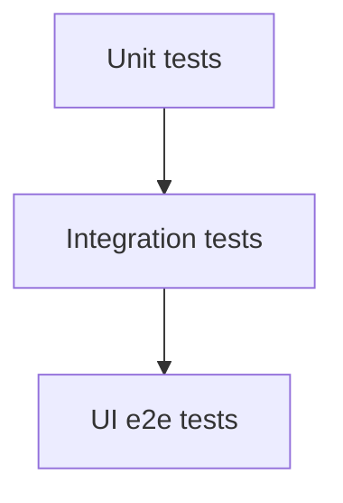
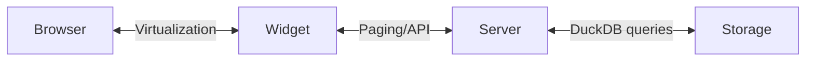
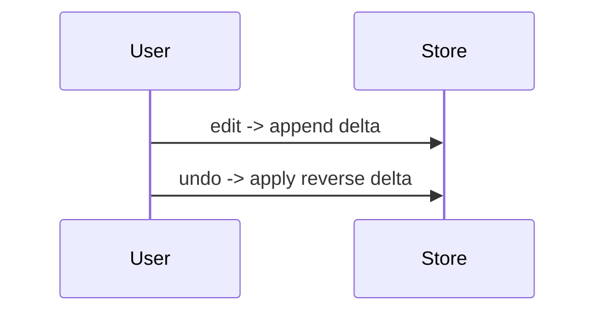

# Atorus Research — 45-minute Mock Interview (atorus.takehome)

## Assumptions

-   Candidate background: 8+ years, R/Shiny architect, R6 expert, comfortable with htmlwidgets and DuckDB.
-   Interview focus: production readiness, modular architecture, persistent state, custom input/output bindings, htmlwidget lifecycle, reactive performance, and UI fidelity.

## Interview lens — what Atorus cares about

-   Production-ready modularity and clear separation of concerns.
-   Durable persistence and atomic saves for data integrity.
-   Custom input/output bindings and htmlwidget lifecycle correctness.
-   Performance-aware reactive patterns for large tables and frequent edits.
-   UI fidelity: consistent UX with minimal surprise when persisting or reverting edits.

------------------------------------------------------------------------

<!-- INSERT: Visual cheat-sheet for visual learners -->
## Visual cheat-sheet (quick maps & analogies)

- Quick note: diagrams are compact—read each, then jump into the detailed questions below.

### 1) DataStore — responsibilities (flow)

Analogy: DataStore is like a bank teller — checks identity (validation), logs transactions, and only sends safe transfers to the vault (DB).

### 2) update_cell — validation (sequence)

Analogy: It's a gatekeeper that either accepts, gently corrects, or rejects an input.

### 3) DB persistence / direct-connection (flow)

Analogy: Direct editing of the canonical file; changes are immediately persisted. Suitable for single-session Shiny apps with bundled data.

### 4) hotwidget JS ↔ R (sequence)

Analogy: Widget sends signed letters with a serial number (nonce); server replies with a receipt.

### 5) reactiveVal(store) + trigger (diagram)

Analogy: Store is a book on a shelf; trigger is a small flag you flip to tell readers "new edition available" without moving the whole book.

### 6) Atomic save (steps)
1. Write to Temp DB
2. Run DB transaction + integrity checks
3. fsync temp file
4. Atomic rename to replace canonical
Analogy: Pack, inspect, seal, then swap crates—never swap a half-packed crate.

### 7) Concurrency options (Venn)

Analogy: Start simple (optimistic), add tags (per-row tokens), switch to live collaboration only if many cooks edit the same pot.

### 8) Testing pyramid (simple)

Analogy: Build a house from many bricks (unit tests), then ensure rooms fit (integration), then walk through the whole house (e2e).

### 9) Scaling to 100k+ rows (flow)

Analogy: Don’t carry the whole library; fetch only the shelf you need.

### 10) Undo/Redo (timeline)

Analogy: A stack of sticky notes with each change; peel the top to undo.

### 11) Packaging & deployment (stack)

Analogy: Freeze your recipe (renv), bake in CI, ship the cake in a box (container) with a safe place for leftovers (persistent volume).

### 12) Observability (short list)
- Metrics to track: save latency, save failure rate, edits/sec, conflict rate, validation failures.
- Use Prometheus + Grafana for dashboards and alerts.

------------------------------------------------------------------------

## Top 12 scripted technical questions (fully scripted)

For each question the subsections appear exactly as specified.

------------------------------------------------------------------------

### Question 1 — Explain responsibilities of `DataStore` R6 class

\[1\] Interviewer Intent

Clarify whether you view `DataStore` as a single-purpose wrapper or a resilient domain object: lifecycle, validation, persistence, and concurrency responsibilities.

\[2\] Three Answer Strategies (A/B/C)

A — Conservative: Describe `DataStore` as a focused abstraction for in-memory state with validation and simple read/write helpers; persist via separate service.

B — Balanced: Explain `DataStore` as the authoritative state holder: validation, typed updates, change history pointers, and save/revert hooks; delegate heavy DB ops to helpers.

C — Standout: Treat `DataStore` as a transactional domain object: typed schema, optimistic locking tokens, audit/version metadata, explicit commit/rollback, and pluggable storage adapters.

\[3\] Comparative Assessment (Relevance, Creativity, Crisp Movement for each strategy)

-   A — Relevance: High for small apps. Creativity: Low. Crisp Movement: Safe, concise.
-   B — Relevance: High for Atorus. Creativity: Medium. Crisp Movement: Strong practical balance.
-   C — Relevance: Very high for production. Creativity: High. Crisp Movement: Bold, shows design leadership.

\[4\] Recommended Interview Answer (exact phrasing the candidate should use)

"My view: `DataStore` is the authoritative in-memory domain object that enforces typed schema and validation, exposes small, well-documented mutation methods (e.g., `update_cell`), tracks change metadata (timestamps/version), and offers explicit save/revert hooks while delegating heavy DB I/O to dedicated helpers for atomic commits."

\[5\] Follow-up & Expansion

-   Point to `DataStore` initialization and public API to show single-responsibility. See [R/DataStore.R](R/DataStore.R).
-   Explain a small adapter pattern to switch persistence backends (DuckDB, S3 snapshots).
-   Describe where validation vs. persistence lives (validation inside `DataStore`, persistence in `write_mtcars_to_db`).

\[6\] Risk & Recovery

Fallback phrase: "At minimum it's responsible for typed state and validation."

Recovery tip: If pressed on implementation, sketch the public methods and their return contracts.

------------------------------------------------------------------------

### Question 2 — How does `update_cell` enforce type safety and validation

\[1\] Interviewer Intent

Probe the candidate's knowledge of typed updates, validation flow, and how to avoid schema drift on frequent edits.

\[2\] Three Answer Strategies (A/B/C)

A — Conservative: Describe simple type checks and coercion inside `update_cell`, returning errors on mismatch.

B — Balanced: Explain pre- and post-validation with coercion rules, NA handling, and emitting structured validation errors for UI display.

C — Standout: Add typed column descriptors, validators per-column, and change-transaction that can be previewed/replayed; integrate with unit tests and property-based tests.

\[3\] Comparative Assessment (Relevance, Creativity, Crisp Movement)

-   A — Relevance: Practical. Creativity: Low. Crisp Movement: Safe but shallow.
-   B — Relevance: Strong for production UX. Creativity: Moderate. Crisp Movement: Clear and applicable.
-   C — Relevance: Very strong for robustness. Creativity: High. Crisp Movement: Demonstrates engineering foresight.

\[4\] Recommended Interview Answer (exact phrasing the candidate should use)

"`update_cell` should accept a typed descriptor and value, coerce when safe, run per-column validators, and return structured results (success, coercedValue, error) so the UI can either accept, warn, or reject the edit."

\[5\] Follow-up & Expansion

-   Show where `validate_column` and `coerce_value` utilities are used (see [R/utils.R](R/utils.R)).
-   Discuss how you’d show immediate validation feedback in the widget.
-   Mention tests to cover coercion and boundary cases; see [tests/testthat/test-DataStore.R](tests/testthat/test-DataStore.R).

\[6\] Risk & Recovery

Fallback phrase: "I’d validate and coerce, failing fast on unsafe changes."

Recovery tip: If unsure of a utility name, describe its shape: input (value, targetType) → output (ok, value, msg).

------------------------------------------------------------------------

### Question 3 — Describe DB persistence and direct-connection architecture

\[1\] Interviewer Intent

Assess understanding of database connection patterns, bundled data handling, and simplicity vs. safety trade-offs in Shiny applications.

\[2\] Three Answer Strategies (A/B/C)

A — Conservative: Explain that the app loads the canonical database file directly and all sessions write directly to it for simplicity.

B — Balanced: Clarify that direct connection works well for single-session bundled apps but acknowledge the trade-off: no file-locking protection or rollback mechanism on failures.

C — Standout: Discuss why `copy_db_to_temp` was considered but not implemented—explain the cost/benefit analysis: added complexity of temp copies and atomic swaps vs. acceptable risk in a bundled, read-mostly app.

\[3\] Comparative Assessment (Relevance, Creativity, Crisp Movement)

-   A — Relevance: Correct for current implementation. Creativity: Low. Crisp Movement: Simple.
-   B — Relevance: Highly practical; shows awareness of trade-offs. Creativity: Moderate. Crisp Movement: Clear.
-   C — Relevance: Highest for architectural decision-making. Creativity: High. Crisp Movement: Thoughtful design reasoning.

\[4\] Recommended Interview Answer (exact phrasing the candidate should use)

"The app validates the bundled database path via `validate_db_path`, then establishes a direct DBI connection to the canonical file. All read/write operations go directly to the file. This is simple and efficient for bundled, mostly-read apps, but lacks the isolation that a temp-copy pattern would provide for concurrent multi-session scenarios."

\[5\] Follow-up & Expansion

-   Mention the architectural intent: a temp-copy + atomic-rename pattern was designed but not implemented to keep the current implementation simple.
-   Discuss when you'd add the temp-copy pattern: multi-session concurrent writes, network-mounted storage with locking issues, or production OLTP scenarios.
-   Point to `validate_db_path`, `establish_duckdb_connection`, and `load_mtcars_data` helpers in R/utils.R.

\[6\] Risk & Recovery

Fallback phrase: "Direct connection is simpler but riskier under failure or concurrent write scenarios."

Recovery tip: If pressed on concurrency, mention that single-session Shiny deployments avoid most contention, and file-level locking is handled by the OS.

------------------------------------------------------------------------

### Question 4 — How does `hotwidget` JS ↔ R communicate edits

\[1\] Interviewer Intent

Check knowledge of htmlwidget lifecycle, custom input bindings, `Shiny.setInputValue`, and reactive storm prevention.

\[2\] Three Answer Strategies (A/B/C)

A — Conservative: Describe a basic `afterChange` in JS that calls `Shiny.setInputValue('hot_changes', payload)`.

B — Balanced: Explain payload shape, debounce/throttle, `priority` usage, and a small acknowledgement channel (e.g., `hot_ack`) to ensure ordered delivery.

C — Standout: Describe a bi-directional protocol: client diffs, server patches, optimistic UI updates, real-time confirmations, and heartbeat/ACK to reconcile concurrent edits.

\[3\] Comparative Assessment (Relevance, Creativity, Crisp Movement)

-   A — Relevance: Basic correctness. Creativity: Low. Crisp Movement: Clear but minimal.
-   B — Relevance: Well suited to Atorus production needs. Creativity: Moderate. Crisp Movement: Solid.
-   C — Relevance: Best for multi-user and resilient UX. Creativity: High. Crisp Movement: Architect-level and persuasive.

\[4\] Recommended Interview Answer (exact phrasing the candidate should use)

"The widget emits structured edit payloads from `afterChange` and uses `Shiny.setInputValue` with a stable input id and an incrementing nonce; the server processes the payload, returns an optional ack value which the JS uses to reconcile or rollback optimistic updates."

\[5\] Follow-up & Expansion

-   Show `hotwidget` JS hooks: see `htmlwidgets/hotwidget.js`.
-   Describe debouncing and how you'd avoid re-entrant updates when server pushes data back.
-   Discuss input binding lifecycle: `initialize` → `renderValue` → `resize` → `onDestroy`.

\[6\] Risk & Recovery

Fallback phrase: "It uses `Shiny.setInputValue` to send structured edits."

Recovery tip: If unsure about nonce, talk about ordering with timestamps as an alternative.

------------------------------------------------------------------------

### Question 5 — Why `reactiveVal(store)` + `store_trigger` invalidation pattern

\[1\] Interviewer Intent

Determine if you understand reactive invalidation granularity and how to avoid unnecessary recomputation.

\[2\] Three Answer Strategies (A/B/C)

A — Conservative: Say it forces controlled invalidation: update trigger rather than whole object replacement.

B — Balanced: Explain that a small trigger separates identity from content, preventing wide reactive dependencies while letting listeners respond to change events selectively.

C — Standout: Propose a fine-grained publish/subscribe pattern with per-row/per-column triggers and derived caches to minimize recomputation.

\[3\] Comparative Assessment (Relevance, Creativity, Crisp Movement)

-   A — Relevance: Correct minimal explanation. Creativity: Low. Crisp Movement: Efficient.
-   B — Relevance: Very applicable for Shiny performance. Creativity: Moderate. Crisp Movement: Clear design rationale.
-   C — Relevance: Best for high-scale editing. Creativity: High. Crisp Movement: Shows deep performance thinking.

\[4\] Recommended Interview Answer (exact phrasing the candidate should use)

"You keep the `store` as the source-of-truth and use a small `store_trigger` reactive to signal changes; this decouples identity from invalidation so only code that cares about change events recomputes instead of everything observing the store object."

\[5\] Follow-up & Expansion

-   Explain how you might implement per-row triggers for large datasets.
-   Mention trade-offs: complexity vs. recompute cost.
-   Point at `mod_table` where triggers drive table re-renders: see [R/mod_table.R](R/mod_table.R).

\[6\] Risk & Recovery

Fallback phrase: "It separates data identity from change signalling."

Recovery tip: If challenged, sketch a quick sequence diagram: update → increment trigger → listeners react.

------------------------------------------------------------------------

### Question 6 — How to make save atomic / avoid partial writes

\[1\] Interviewer Intent

Validate knowledge of atomic persistence operations and crash-safe commit patterns.

\[2\] Three Answer Strategies (A/B/C)

A — Conservative: Use write-to-temp + atomic rename and fsync steps.

B — Balanced: Use temp copy + DB-level transaction + checksum + atomic swap; include backup copy before replace.

C — Standout: Add multi-stage commit with WAL/offline staging, per-change idempotent operations, CRC verification, and optional server-side merge with conflict detection.

\[3\] Comparative Assessment (Relevance, Creativity, Crisp Movement)

-   A — Relevance: Good baseline. Creativity: Low. Crisp Movement: Pragmatic.
-   B — Relevance: Strong production approach. Creativity: Moderate. Crisp Movement: Clear and actionable.
-   C — Relevance: Excellent for critical data. Creativity: High. Crisp Movement: Shows deep ops awareness.

\[4\] Recommended Interview Answer (exact phrasing the candidate should use)

"Write all changes to a temp DB, run a DB transaction to ensure integrity, fsync the temp file, then atomically rename to replace the canonical DB; add a backup snapshot before swap so rollback is trivial."

\[5\] Follow-up & Expansion

-   Discuss DB transactions inside DuckDB and filesystem semantics on Windows vs. Linux.
-   Mention potential use of object storage for immutable snapshots.
-   Explain the architectural choice: direct connection is simple now, but temp-copy pattern could be added for multi-session scenarios.

\[6\] Risk & Recovery

Fallback phrase: "Direct connection is pragmatic for bundled single-session apps."

Recovery tip: If asked about Windows, mention that OS-level file locking handles most issues, and bundled data is mostly read.

------------------------------------------------------------------------

### Question 7 — Concurrency & multi-user edits strategy

\[1\] Interviewer Intent

Assess architectural options for concurrent sessions and conflict resolution strategies.

\[2\] Three Answer Strategies (A/B/C)

A — Conservative: Single-writer model with optimistic lock: last-writer-wins or reject on version mismatch.

B — Balanced: Optimistic concurrency with per-row version tokens, server-side merge rules, and per-cell conflict UI.

C — Standout: Operational Transform / CRDT approach for collaborative edits or a central real-time service (websocket) to coordinate locks and merges.

\[3\] Comparative Assessment (Relevance, Creativity, Crisp Movement)

-   A — Relevance: Simple to implement. Creativity: Low. Crisp Movement: Fast decision.
-   B — Relevance: Realistic for Atorus needs. Creativity: Moderate. Crisp Movement: Shows product thinking.
-   C — Relevance: High for collaborative use-cases. Creativity: High. Crisp Movement: Ambitious and advanced.

\[4\] Recommended Interview Answer (exact phrasing the candidate should use)

"For most Atorus use-cases I'd start with optimistic concurrency: attach a per-session/version token, detect mismatches on save, and surface per-cell conflicts with merge options; for heavy collaboration, migrate to a real-time coordination layer."

\[5\] Follow-up & Expansion

-   Describe UI flows for conflict resolution (accept server, accept mine, merge).
-   Mention how to persist conflict metadata for audit.
-   Discuss scaling path from optimistic locks to OT/CRDT.

\[6\] Risk & Recovery

Fallback phrase: "Start optimistic; escalate to real-time coordination when needed."

Recovery tip: If pressed on OT/CRDT, sketch high-level pros/cons and recommend a proof-of-concept.

------------------------------------------------------------------------

### Question 8 — Testing strategy for widget edits end-to-end

\[1\] Interviewer Intent

Judge practical testing approach (unit, integration, e2e) and use of shinytest2/htmlwidget test hooks.

\[2\] Three Answer Strategies (A/B/C)

A — Conservative: Unit-test `DataStore` and server logic; minimal UI smoke tests.

B — Balanced: Add integration tests with `shinytest2`, simulate edit events to the widget, assert DB state and UI reconciliation; unit tests for utils.

C — Standout: Full e2e with headless browser driving `hotwidget` JS hooks and network stubbing, property-based tests for edit sequences, CI gating with artifacted DB snapshots.

\[3\] Comparative Assessment (Relevance, Creativity, Crisp Movement)

-   A — Relevance: Basic quality. Creativity: Low. Crisp Movement: Safe.
-   B — Relevance: Strong—fits this repo (see tests). Creativity: Moderate. Crisp Movement: Practical and achievable.
-   C — Relevance: Highest confidence. Creativity: High. Crisp Movement: Demonstrates testing leadership.

\[4\] Recommended Interview Answer (exact phrasing the candidate should use)

"I'd combine unit tests for `DataStore` and validators, integration tests using `shinytest2` to simulate widget edit payloads and assert DB writes, and CI e2e runs that snapshot DBs for reproducibility."

\[5\] Follow-up & Expansion

-   Point to existing tests: [tests/testthat/test-DataStore.R](tests/testthat/test-DataStore.R) and [tests/testthat/test-mod_table.R](tests/testthat/test-mod_table.R).
-   Mention mocking `Shiny.setInputValue` events in JS-driven tests.
-   Discuss CI test matrix and artifact storage for failing DB snapshots.

\[6\] Risk & Recovery

Fallback phrase: "Unit tests + integration tests with `shinytest2` cover most risk."

Recovery tip: If short on time, propose a prioritized test list: core validations → persistence → UI reconciliation.

------------------------------------------------------------------------

### Question 9 — Scaling to 100k+ rows (performance strategy)

\[1\] Interviewer Intent

Test ability to design for responsiveness with large datasets: virtual rendering, paged DB access, reactive cost control.

\[2\] Three Answer Strategies (A/B/C)

A — Conservative: Use server-side pagination and avoid sending all rows to client.

B — Balanced: Combine virtual scrolling in the widget, server-side filtering/aggregation, column projection, and incremental diffs for edits.

C — Standout: Add columnar storage optimizations, query pushdown in DuckDB, background indexing, on-demand materialized views, and async chunked saves to avoid blocking the UI.

\[3\] Comparative Assessment (Relevance, Creativity, Crisp Movement)

-   A — Relevance: Immediately practical. Creativity: Low. Crisp Movement: Simple.
-   B — Relevance: Very strong for interactive UX. Creativity: Moderate. Crisp Movement: Well-rounded.
-   C — Relevance: High for extreme scale. Creativity: High. Crisp Movement: Demonstrates deep performance engineering.

\[4\] Recommended Interview Answer (exact phrasing the candidate should use)

"Don’t stream 100k rows to the browser; use virtualized rendering with server-side paging and stitched diffs for edits, push down filters to DuckDB, and only send minimal row/col slices plus optimistic edit deltas."

\[5\] Follow-up & Expansion

-   Discuss how `hotwidget` supports virtualization and how you'd wire server paging.
-   Talk about caching derived aggregations and invalidation strategy.
-   Note memory/CPU trade-offs and monitoring.

\[6\] Risk & Recovery

Fallback phrase: "Use server-side paging and virtual rendering."

Recovery tip: If asked about a concrete number, say you’d benchmark with representative workloads and tune.

------------------------------------------------------------------------

### Question 10 — Undo/Redo design options

\[1\] Interviewer Intent

Assess data-model for history, memory costs, and UX semantics for undo/redo.

\[2\] Three Answer Strategies (A/B/C)

A — Conservative: Keep a fixed-length command stack of deltas for undo/redo in memory.

B — Balanced: Store immutable deltas with compact encodings, allow session undo/redo, and persist commit checkpoints for long-term undo.

C — Standout: Use an append-only change log with snapshot checkpoints and compaction; support cross-session undo with conflict-aware rebase.

\[3\] Comparative Assessment (Relevance, Creativity, Crisp Movement)

-   A — Relevance: Quick to ship. Creativity: Low. Crisp Movement: Pragmatic.
-   B — Relevance: Good balance for production. Creativity: Moderate. Crisp Movement: Clear and usable.
-   C — Relevance: Powerful for audit and collaboration. Creativity: High. Crisp Movement: Complex but robust.

\[4\] Recommended Interview Answer (exact phrasing the candidate should use)

"I’d implement undo/redo as an append-only change log of compact deltas with periodic snapshot checkpoints; this gives efficient in-memory undo and an on-disk history for audit and cross-session operations."

\[5\] Follow-up & Expansion

-   Discuss memory capping and log compaction policies.
-   Describe UI: inline undo stack vs. action history modal.
-   Mention testing for long sequences and recovery.

\[6\] Risk & Recovery

Fallback phrase: "A bounded delta stack is the minimal viable undo."

Recovery tip: If memory comes up, propose snapshot+compaction immediately.

------------------------------------------------------------------------

### Question 11 — Packaging/deployment for production (Docker/RStudio Connect)

\[1\] Interviewer Intent

Judge knowledge of production deployment patterns for Shiny apps and packaging artifacts.

\[2\] Three Answer Strategies (A/B/C)

A — Conservative: Docker container with pinned R package versions and renv; mount persistent storage for DB.

B — Balanced: Containerize with multi-stage builds, healthchecks, CI-built images, and optional RStudio Connect deployment using packrat/renv snapshots.

C — Standout: Kubernetes deployment with sidecar for backups, metrics, autoscaling, image signing, and runtime configuration via Vault/ConfigMaps.

\[3\] Comparative Assessment (Relevance, Creativity, Crisp Movement)

-   A — Relevance: Solid baseline. Creativity: Low. Crisp Movement: Practical.
-   B — Relevance: Strong for mature teams. Creativity: Moderate. Crisp Movement: Realistic and secure.
-   C — Relevance: Best for enterprise at scale. Creativity: High. Crisp Movement: Demonstrates SRE thinking.

\[4\] Recommended Interview Answer (exact phrasing the candidate should use)

"I’d package with `renv::snapshot()`, produce a CI-built Docker image, run it in production with persistent volumes for the DB and managed backups; for scale use Kubernetes and add sidecars for backup and health monitoring."

\[5\] Follow-up & Expansion

-   Explain how you’d manage secrets and DB path configuration.
-   Mention image scanning and dependency pinning.
-   Provide optional RStudio Connect steps for a non-containerized deployment.

\[6\] Risk & Recovery

Fallback phrase: "Start with Docker + renv and add infra as needed."

Recovery tip: If asked about Connect, say you’d supply an `renv.lock` for Connect deployment.

------------------------------------------------------------------------

### Question 12 — Observability & metrics to monitor

\[1\] Interviewer Intent

See if you propose actionable metrics for health, performance, and data integrity.

\[2\] Three Answer Strategies (A/B/C)

A — Conservative: Monitor uptime, request latency, and error rates.

B — Balanced: Add application metrics: save latency, conflict rate, edits/sec, DB size, and slow queries; expose Prometheus metrics and structured logs.

C — Standout: Add business/UX metrics: user edit sessions, acceptance/rejection rates, per-column validation failures, plus tracing for latency hotspots and anomaly detection on save failures.

\[3\] Comparative Assessment (Relevance, Creativity, Crisp Movement)

-   A — Relevance: Basic ops. Creativity: Low. Crisp Movement: Minimal.
-   B — Relevance: Very relevant for production ops. Creativity: Moderate. Crisp Movement: Actionable.
-   C — Relevance: High for product insight. Creativity: High. Crisp Movement: Data-driven and strategic.

\[4\] Recommended Interview Answer (exact phrasing the candidate should use)

"Track infrastructure metrics (latency, errors), app metrics (edits/sec, save latency, conflict rate), and data-health metrics (validation failures, DB size); export them to Prometheus/Grafana and keep structured logs for debugging."

\[5\] Follow-up & Expansion

-   Suggest alert thresholds for save failure rate and long-running saves.
-   Recommend sampling edit payloads for debugging while respecting PII.
-   Mention tracing to correlate UI latency with DB query times.

\[6\] Risk & Recovery

Fallback phrase: "Monitor latency, errors and edits per second."

Recovery tip: If asked for tools, quickly name Prometheus + Grafana + Loki for logs.

------------------------------------------------------------------------

## Minute-by-minute 45-minute interview script (compact)

-   00:00–00:02 — Quick intro, set expectations, confirm your background and assumptions.
-   00:02–00:04 — High-level walkthrough: repo layout and goals. Show key files: `R/DataStore.R`, `R/mod_table.R`, `R/hotwidget.R`, `htmlwidgets/hotwidget.js`.
-   00:04–00:10 — Question 1 (DataStore responsibilities) — 6 minutes (2 min answer, 4 min probe). Open `R/DataStore.R`.
-   00:10–00:14 — Question 2 (update_cell type safety) — 4 minutes. Reference `R/utils.R` and validation utilities.
-   00:14–00:17 — Question 3 (DB persistence & direct-connection architecture) — 3 minutes. Reference `validate_db_path` and `R/DataStore.R`.
-   00:17–00:20 — Question 4 (hotwidget JS ↔ R) — 3 minutes. Show `htmlwidgets/hotwidget.js`.
-   00:20–00:23 — Question 5 (reactiveVal(store)+store_trigger) — 3 minutes. Show `R/mod_table.R`.
-   00:23–00:26 — Question 6 (atomic saves) — 3 minutes. Discuss temp-copy flow and atomic rename.
-   00:26–00:29 — Question 7 (concurrency & multi-user edits) — 3 minutes. Explore optimistic vs. real-time.
-   00:29–00:33 — Question 8 (testing strategy) — 4 minutes. Show `tests/testthat/test-DataStore.R` and `tests/testthat/test-mod_table.R`.
-   00:33–00:36 — Question 9 (scaling to 100k+ rows) — 3 minutes. Discuss virtualization and server-side paging.
-   00:36–00:39 — Question 10 (undo/redo) — 3 minutes. Sketch change log design.
-   00:39–00:41 — Question 11 (packaging/deployment) — 2 minutes. Mention `renv` and Docker.
-   00:41–00:43 — Question 12 (observability & metrics) — 2 minutes. Brief metrics and alert ideas.
-   00:43–00:45 — Candidate closing: 2 minutes. Candidate asks their questions (see suggested list).

Optional test run command (to point to tests briefly)

``` bash
Rscript -e "remotes::install_deps(dependencies=TRUE); testthat::test_dir('tests/testthat')"
```

------------------------------------------------------------------------

## Deep Code Phrasing — exact sentences to say while pointing at key symbols

-   While pointing at `initialize` in `R/DataStore.R`: "This `initialize` sets the authoritative in-memory schema and seed data; it’s intentionally lightweight to allow swapping persistence adapters."
-   While pointing at `update_cell` in `R/DataStore.R`: "Here `update_cell` accepts a typed value, runs coercion and validator hooks, and returns a structured result so the UI can decide accept/warn/reject."
-   While pointing at `save` in `R/DataStore.R`: "The `save` method writes to a temp DB and only performs an atomic swap after integrity checks and fsync to avoid partial writes."
-   While pointing at `revert` in `R/DataStore.R`: "`revert` applies a rollback to the last snapshot or discards the in-memory deltas to restore a safe state."
-   While pointing at the JS `afterChange` handler in `htmlwidgets/hotwidget.js`: "This `afterChange` builds a compact edit payload and calls `Shiny.setInputValue` with a nonce to preserve ordering."
-   While pointing at the JS call to `Shiny.setInputValue` in `htmlwidgets/hotwidget.js`: "We use `Shiny.setInputValue` with `priority='event'` and a nonce so server receives reliable, ordered edit events."

------------------------------------------------------------------------

## Data & Storage Platform (concise bullets)

-   DuckDB rationale: fast analytical queries, columnar performance, embeddable with simple file-based persistence.
-   Temp-copy rationale: isolates session writes, prevents locking and corrupting canonical DB, enables atomic swap.
-   Atomicity trade-offs: atomic rename is simple and robust on POSIX; on Windows test rename semantics and include explicit backup copy for robustness.
-   Backup/versioning suggestions: periodic timestamped snapshots, retain N versions, store compressed snapshots in object storage for long-term retention.
-   Production placement: put canonical DB on managed block storage with regular backups; do not store canonical DB inside ephemeral container layers — use mounted PV or external storage.

------------------------------------------------------------------------

## Panic-control anchors — exact fallback phrases to say verbatim

-   "Short answer: it isolates session writes from the canonical DB."
-   "My minimal approach would be write-to-temp then atomic-rename."
-   "We validate and coerce edits, failing fast on unsafe changes."
-   "Start with optimistic concurrency; escalate to real-time coordination only if usage demands."
-   "Unit tests plus integration tests with `shinytest2` will catch the majority of regressions."

## Five quick recovery tips (what to do if stuck)

-   If you can't recall a helper name, describe its inputs and outputs instead.
-   If unsure about OS semantics, state you’d validate rename/fsync behavior on both Windows and Linux.
-   If pressed for metrics, prioritize save-fail rate and save latency.
-   If you forget a JS hook name, describe the lifecycle (init, render, afterChange, destroy).
-   If you're interrupted, offer to sketch a brief diagram and follow up with a short PR.

------------------------------------------------------------------------

## Six strong closing questions for the interviewer (you can ask)

-   How do you expect the app to be used in production: single-user desktop, hosted multi-user, or both?
-   What SLAs or performance targets should we optimize for (latency, concurrency)?
-   Are there existing observability stacks (Prometheus/Grafana/Loki) we should integrate with?
-   Do you have an expected backup/retention policy or regulatory constraints?
-   How important is cross-session undo/history vs. session-only undo?
-   Would you prefer adding a real-time collaboration layer now, or iterating from optimistic concurrency?

------------------------------------------------------------------------

## Notes for the interviewer (brief)

-   When probing answers, ask for concrete trade-offs (complexity vs. benefit).
-   Ask the candidate to point to the repo files during the interview; links above will guide them.
-   Timebox follow-ups tightly to keep to 45 minutes.

## References (files to show during interview)

-   [R/DataStore.R](R/DataStore.R)
-   [R/mod_table.R](R/mod_table.R)
-   [R/hotwidget.R](R/hotwidget.R)
-   [htmlwidgets/hotwidget.js](htmlwidgets/hotwidget.js)
-   [tests/testthat/test-DataStore.R](tests/testthat/test-DataStore.R)
-   [tests/testthat/test-mod_table.R](tests/testthat/test-mod_table.R)

------------------------------------------------------------------------

End of document.